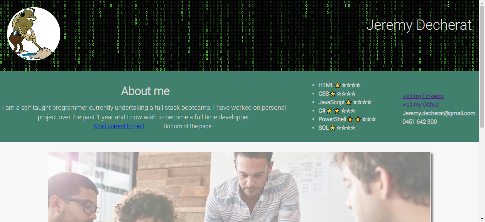

# Jeremy's portfolio

## Description

The goal for thisproject was to create a portfolio to showcase my work and present it to future employers.

## Table of Contents (Optional)

- [Installation](#installation)
- [Usage](#usage)
- [Links](#links)

## Installation

Simply open the html file in your preferred web browser.

## Usage

Once on the web page, use the link to navigate to my Github, LinkedIn or navigate to the different part of hte page.

Each of my previous works are represented on the page.
Just click on the project's title to be redirected to the deployed application.

## Links

Deployed application: https://gator2-0.github.io/Jeremy-portfolio/

